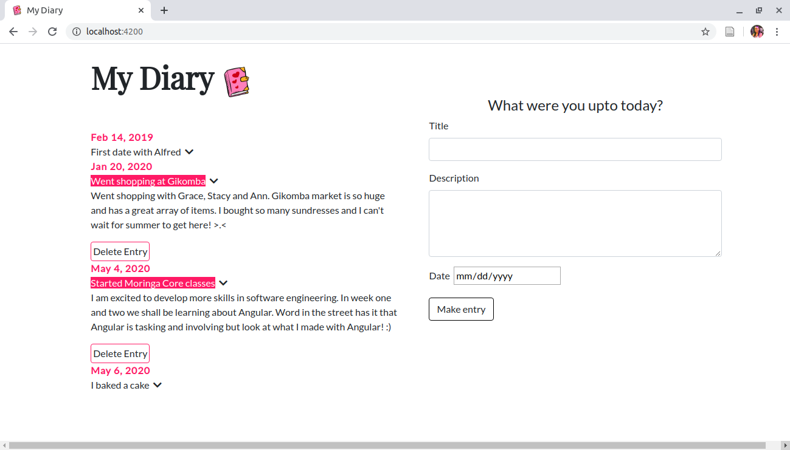

# My Diary
#### An online diary, 06/05/2020
#### By Lorna Kamau

## Description
An online diary that allows users to make entries based on title, description and date. The application also allows the user to view previous diary entries. The user can also highlight the title, toggle between hiding and showing the entry's description and also deleting the entry altogether.

## Development
To make advancements/modifications, follow these steps:

- Fork the repository
- Create a new branch (`git checkout -b improve-feature`)
- Make the appropriate changes in the files
- Add changes made
- Commit your changes (`git commit -am 'Improve feature'`)
- Push to the branch (`git push origin improve-feature`)
- Create a Pull Request 

## Known Bugs

There are no known bugs

## Technologies Used

This project was generated with [Angular CLI](https://github.com/angular/angular-cli) version 9.1.4.
The technologies used are HTML, CSS, Javascript and Bootstrap.

## Support and contact details

Should you be unable to access the website, have any recommendations or questions, feel free to email me:[kamaulorna@gmail.com](mailto:kamaulorna@gmail.com)

## To-do
1. Store diary entries in a database

## [License](https://github.com/lornakamau/diary/blob/master/LICENSE.md)

Copyright (c) 2020 [Lorna Kamau](https://github.com/lornakamau)  